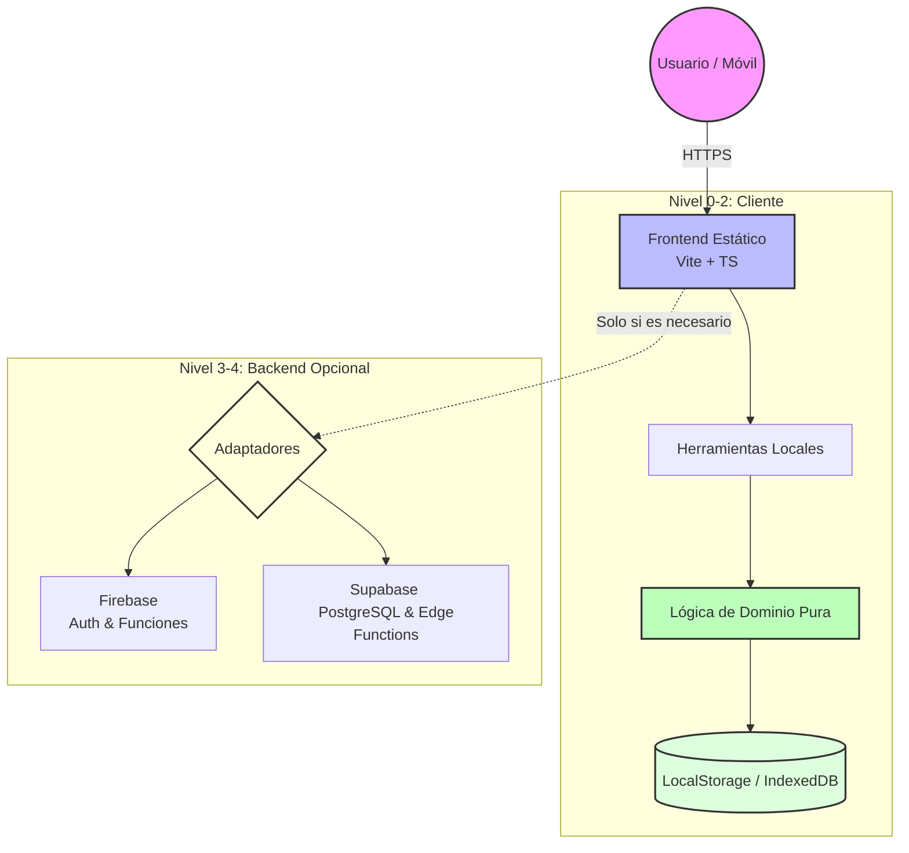

Aquí tienes el contenido completo para tu `README.md`. He fusionado la visión estratégica del **Documento Maestro** con los detalles técnicos precisos de la **Especificación Técnica**, dándole un formato visualmente impactante, profesional y listo para copiar y pegar directamente en GitHub.

***

```markdown
# 🧪 ANDRYUS LAB

> **"No almacenar lo que puede calcularse nuevamente; no conservar lo que puede expirar; no subir al servidor lo que puede procesarse en el navegador."**

<div align="center">

[](https://www.typescriptlang.org/)
[](https://vitejs.dev/)
[](https://firebase.google.com/)
[](https://supabase.com/)
[](LICENSE)

</div>

---

## 📖 Índice

1. [Visión y Filosofía](#-visión-y-filosofía)
2. [Arquitectura Modular](#-arquitectura-modular)
3. [Stack Tecnológico](#-stack-tecnológico)
4. [Las Herramientas (MVP)](#-las-herramientas-mvp)
5. [Gestión de Datos y Privacidad](#-gestión-de-datos-y-privacidad)
6. [Estructura del Proyecto](#-estructura-del-proyecto)
7. [Guía de Inicio Rápido](#-guía-de-inicio-rápido)
8. [Roadmap de Desarrollo](#-roadmap-de-desarrollo)
9. [Definición de Terminado (DoD)](#-definición-de-terminado-dod)

---

## 👁️ Visión y Filosofía

**Andryus Lab** no es una simple colección de utilidades web. Es un **motor de micro-soluciones digitales**. Nuestra misión es proporcionar herramientas ligeras, rápidas y móviles-first que resuelvan problemas concretos sin la carga operativa de plataformas monolíticas tradicionales.

### Los 6 Pilares Arquitectónicos

| # | Principio | Regla de Oro |
|:-:|-----------|--------------|
| 1 | 🏠 **Local-First** | Si puede hacerse con JS en el dispositivo, se hace localmente. Cero latencia, cero coste. |
| 2 |  **Minimización de Datos** | Solo se almacena el dato imprescindible. Nada más. |
| 3 | ⏳ **Efímero por Defecto** | Todo dato temporal tiene un TTL (Time-To-Live). La basura se limpia sola. |
| 4 | ☁️ **Sin Almacenamiento Pesado** | Evitamos usar la nube como depósito de PDFs/imágenes si pueden generarse localmente. |
| 5 | 🔌 **Independencia de Proveedor** | Firebase y Supabase son intercambiables. No nos casamos con ningún SDK. |
| 6 | 🧩 **Modularidad Extrema** | Cada herramienta es un módulo aislado con sus propias pruebas y lógica. |

---

## 🏗️ Arquitectura Modular

La arquitectura está diseñada para escalar horizontalmente añadiendo herramientas, no verticalmente aumentando la complejidad del backend.



### La Regla de Oro para Desarrolladores e IAs

Antes de tocar cualquier API externa, responde estas dos preguntas obligatorias:

1. ❓ **¿Por qué esta función NO puede ejecutarse localmente?**
   * Si hay una respuesta técnica válida → Se añade el servicio.
   * Si no la hay → Permanece local.

2. ❓ **¿Qué dato estamos almacenando y durante cuánto tiempo?**
   * Si no hay una respuesta concreta sobre retención/TTL → Ese dato **no debe almacenarse**.

---

## 💻 Stack Tecnológico

Hemos elegido tecnologías modernas, tipadas y eficientes para garantizar rendimiento y mantenibilidad.

| Capa | Tecnología | Razón Estratégica |
|------|------------|-------------------|
| **Core** | `Vite` + `TypeScript` | Ligereza extrema, HMR rápido y seguridad de tipos. |
| **UI** | `HTML/CSS` + Componentes Propios | Sin dependencias pesadas de frameworks UI innecesarios. Mobile-first nativo. |
| **Estado Local** | `LocalStorage` / `IndexedDB` | Persistencia instantánea sin round-trip al servidor. |
| **Backend A** | `Firebase` | Autenticación rápida y funciones serverless puntuales. |
| **Backend B** | `Supabase` | PostgreSQL robusto para relaciones estructuradas y APIs RESTful. |
| **Testing** | `Vitest` | Pruebas unitarias ultrarrápidas integradas con Vite. |
| **Calidad** | `ESLint` + `Prettier` | Consistencia automática del código. |
| **CI/CD** | `GitHub Actions` | Build, test y despliegue automatizados desde push. |

---

## 🛠️ Las Herramientas (MVP)

El MVP demuestra la arquitectura con cuatro casos de uso distintos, cubriendo desde cálculo puro hasta persistencia temporal controlada.

### 1. 💰 Real Cost Calculator
* **Tipo:** Cálculo Local Puro.
* **Función:** Suma componentes de coste (compra, envío, comisiones, impuestos, packaging, ads) para dar el costo real y margen.
* **Persistencia:** Ninguna (`persistence: none`).
* **Requisito Backend:** ❌ Ninguno.

### 2. 🔋 Battery Runtime Calculator
* **Tipo:** Diagnóstico Estimado.
* **Función:** Calcula autonomía aproximada basándose en capacidad y consumo. Incluye advertencias claras sobre supuestos físicos.
* **Persistencia:** Ninguna.
* **Requisito Backend:** ❌ Ninguno.

### 3. 📱 QR Generator
* **Tipo:** Generación Visual.
* **Función:** Genera códigos QR en el navegador usando canvas/SVG. El contenido nunca sale del dispositivo.
* **Persistencia:** Ninguna.
* **Requisito Backend:** ❌ Ninguno.

### 4. ⏳ Temporary Share *(El Caso Especial)*
* **Tipo:** Persistencia Efímera.
* **Función:** Permite compartir texto/enlaces temporales que expiran automáticamente.
* **Flujo Técnico:**
  1. Cliente envía payload + TTL.
  2. Servidor valida esquema (Zod).
  3. Se genera ID aleatorio y se guarda con `expiresAt`.
  4. Se devuelve URL corta.
  5. En lectura: Verifica `now() >= expiresAt`. Si sí → 404. Si no → Devuelve contenido e incrementa views.
* **Seguridad:** Rate limiting aplicado. Sanitización de inputs. Nunca promete privacidad absoluta (cifrado E2E futuro opcional).
* **Requisito Backend:** ✅ Sí (Firebase o Supabase).

---

## 🔄 Gestión de Datos y Privacidad

Nos tomamos muy en serio la minimización de datos. Aquí están las políticas de almacenamiento estratificadas:

| Nivel | Medio | Uso | Ejemplo |
|-------|-------|-----|---------|
| **L0** | Memoria RAM | Sesión actual | Datos de formulario mientras escribes. |
| **L1** | LocalStorage | Preferencias pequeñas | Tema oscuro/claro, idioma. |
| **L2** | IndexedDB | Datos locales mayores | Historial de cálculos guardados manualmente por el usuario. |
| **L3** | Backend Remoto | Compartición/Sincronización | Solo `Temporary Share` en v1.0. |
| **L4** | Cloud Storage | Archivos binarios | **PROHIBIDO** en v1.0 salvo justificación extrema. |

### ♻️ Política de TTL (Time-To-Live)
* Todo registro temporal nace con fecha de muerte (`expiresAt`).
* El backend **rechaza** elementos vencidos incluso si el job de limpieza aún no los ha borrado físicamente.
* Limpieza idempotente: correr el script de borrado dos veces no rompe nada.
* Límite MVP: Máximo 7 días de vida.

---

## 📂 Estructura del Repositorio

Una separación clara entre presentación, dominio y servicios garantiza que podamos cambiar el backend sin reescribir las herramientas.

```text
andryus-lab/
├── apps/
│   └── web/                  # Aplicación principal frontend
│       ├── src/
│       │   ├── app/          # Routing y entry points
│       │   ├── components/   # UI atoms/molecules
│       │   ├── layouts/      # Estructuras de página
│       │   ├── pages/        # Vistas específicas
│       │   ├── tools/        # 🧩 LÓGICA DE LAS HERRAMIENTAS
│       │   │   ├── real-cost/
│       │   │   ├── battery-runtime/
│       │   │   ├── qr-generator/
│       │   │   └── temporary-share/
│       │   ├── domain/       # 🧠 FUNCIONES PURAS (Sin side-effects)
│       │   ├── repositories/ # 🗄️ INTERFACES DE DATOS
│       │   │   └── adapters/
│       │   │       ├── firebase/
│       │   │       └── supabase/
│       │   ├── security/     # Validaciones, sanitización, auth guards
│       │   └── utils/        # Helpers genéricos
│       ├── tests/            # Vitest suites
│       └── public/           # Assets estáticos
├── packages/                 # Monorepo shared libs (futuro)
├── docs/                     # Documentación técnica
├── .github/workflows/        # CI/CD Pipelines
├── package.json
├── tsconfig.json
└── README.md
```

> ⚠️ **Regla Crítica:** Una herramienta (`tools/`) **nunca** debe importar directamente un SDK de Firebase/Supabase. Debe hablar siempre a través de una interfaz en `repositories/adapters`. Esto permite swapear backends fácilmente.

---

## 🚀 Guía de Inicio Rápido

Sigue estos pasos para levantar el proyecto localmente.

### Pre-requisitos
* Node.js ≥ 18.x
* npm, pnpm o yarn

### Instalación

```bash
# 1. Clonar el repositorio
git clone https://github.com/tu-usuario/andryus-lab.git
cd andryus-lab

# 2. Instalar dependencias
npm install

# 3. Configurar variables de entorno (ejemplo)
cp .env.example .env.local
# Edita .env.local con tus claves de Firebase/Supabase si usas Temporary Share

# 4. Levantar servidor de desarrollo
npm run dev
```

### Scripts Disponibles

```bash
npm run build      # Compila para producción
npm run preview    # Sirve la build localmente
npm run lint       # Revisa estilo de código
npm run typecheck  # Valida tipos TypeScript
npm run test       # Corre suite de pruebas unitarias
```

---

## 🗺️ Roadmap de Desarrollo

Planificación ágil dividida en sprints enfocados en valor incremental.

| Sprint | Foco Principal | Entregables Clave |
|--------|----------------|-------------------|
| **S1** | 🏗️ Infraestructura | Repo setup, Vite+TS, CI básico, UI Shell. |
| **S2** | 🧮 Núcleo Local | Real Cost, Battery Calc, QR Gen (100% offline). |
| **S3** | 🎨 Calidad UX | Testing riguroso, SEO técnico, Accesibilidad AA, PWA manifest. |
| **S4** | ☁️ Persistencia Temporal | Temporary Share, Adaptador Backend, TTL Logic, Rate Limiting. |
| **S5** | 🔐 Identidad | Auth opcional (Google/GitHub), Dashboard mínimo de historial. |
| **S6** | 📊 Observabilidad | Métricas de uso, costes estimados, experimentos monetización. |
| **S7** | 🌿 Expansión | Nuevas herramientas basadas en analytics reales de usuarios. |

---

## ✅ Definición de Terminado (Definition of Done)

Para que una Pull Request sea aceptada, debe cumplir **todos** estos puntos:

- [ ] Código tipado estrictamente (`strict: true` en TSConfig).
- [ ] Formateado con Prettier y limpio según ESLint.
- [ ] Todos los tests unitarios pasan (casos normales, extremos y errores).
- [ ] **CERO secretos** en Git (variables de entorno protegidas).
- [ ] Validación de entradas en cliente Y servidor (si aplica).
- [ ] Responsive verificado en Android (mínimo 360px ancho).
- [ ] Estados de UI claros: Loading, Success, Error, Empty.
- [ ] Documentación JSDoc en funciones públicas.
- [ ] Impacto en métricas estimado (si toca backend).
- [ ] Build reproducible desde checkout limpio.

---

## 📝 Notas Finales

**Andryus Lab** está diseñado para ser económicamente sostenible. Priorizamos el procesamiento local porque reduce costos de egress y cómputo cloud a casi cero para la mayoría de operaciones. 

> *"La infraestructura existe para habilitar soluciones, no para convertirse en el centro del producto."*

Si eres desarrollador o IA contribuyendo a este repo, recuerda: **Menos es Más.** Antes de añadir una línea de código que hable con un servidor, pregúntate si realmente necesitas salir del navegador.

---

<div align="center">

Hecho con ❤️ y mucha cafeína ☕  
© 2026 Andryus Lab Team

</div>
```
